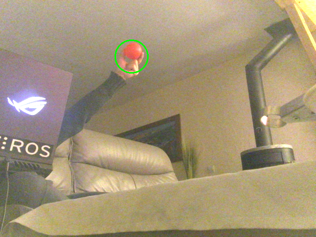

# Red Ball Tracker (ROS 2 C++ Node)

**Auteur : Vincent Foucault**
**Date : 28 mars 2026**

---

## 📌 Description

Le node `red_ball_tracker_cpp` est un composant ROS 2 permettant de détecter et suivre une balle rouge dans un flux vidéo. Il utilise OpenCV pour le traitement d’image et un filtre de Kalman pour lisser et prédire la position de la balle.

Le système est conçu pour :

* Détecter une balle rouge en temps réel
* Publier une région d’intérêt (ROI)
* Fournir une image de debug
* Gérer la perte de cible avec un mécanisme de reset

---

## ⚙️ Fonctionnement global

### 1. Acquisition de l’image

Le node s’abonne à un flux image (`sensor_msgs/Image`) provenant d’une caméra.

### 2. Détection de la balle rouge

Le traitement comprend :

* Conversion BGR → HSV
* Seuillage sur deux plages de rouge (0–10 et 170–180)
* Nettoyage du masque (morphologie : open + close)
* Flou gaussien
* Détection des contours
* Sélection du plus grand contour
* Approximation par cercle englobant

Une balle est validée si son rayon est dans un intervalle défini.

---

### 3. Suivi avec filtre de Kalman

Le filtre de Kalman est utilisé pour :

* Lisser la position détectée
* Prédire la position si la balle est temporairement perdue

#### État :

```
[x, y, vx, vy]
```

#### Mesure :

```
[x, y]
```

* Si la balle est détectée → correction du filtre
* Sinon → prédiction seule

---

### 4. Gestion de la perte de cible

Si aucune balle n’est détectée pendant une durée supérieure à `loss_timeout` :

* Publication d’un message de reset
* Permet de repositionner la tête du robot en position neutre

Quand la balle est retrouvée :

* Annulation du reset

---

### 5. Publication des résultats

#### ROI (Region of Interest)

* Correspond à la zone contenant la balle
* Basée sur le rayon détecté ou estimé

#### Image de debug

* Affiche la balle détectée (cercle + centre)

---

## 📡 Topics

### 🔵 Souscription

| Topic                 | Type                    | Description    |
| --------------------- | ----------------------- | -------------- |
| `/inverted_eye_image` | `sensor_msgs/msg/Image` | Image d’entrée |

---

### 🟢 Publications

| Topic                      | Type                               | Description             |
| -------------------------- | ---------------------------------- | ----------------------- |
| `/target_roi`              | `sensor_msgs/msg/RegionOfInterest` | Zone contenant la balle |
| `/red_ball_tracking_debug` | `sensor_msgs/msg/Image`            | Image annotée           |
| `/reset_head_neutral`      | `std_msgs/msg/Bool`                | Commande de reset tête  |

---

## 🔧 Paramètres

| Paramètre         | Description             | Valeur par défaut |
| ----------------- | ----------------------- | ----------------- |
| `lower_red_h/s/v` | Seuil HSV bas           | (0, 120, 70)      |
| `upper_red_h/s/v` | Seuil HSV haut          | (10, 255, 255)    |
| `min_radius`      | Rayon minimum           | 10                |
| `max_radius`      | Rayon maximum           | 100               |
| `blur_kernel`     | Taille du flou (impair) | 9                 |
| `loss_timeout`    | Temps avant reset (s)   | 2.0               |

📌 Tous les paramètres sont modifiables dynamiquement.

---

## 🔁 Logique de reset

* Si balle absente > `loss_timeout` :

  ```
  /reset_head_neutral = true
  ```
* Si balle retrouvée :

  ```
  /reset_head_neutral = false
  ```

---

## 🧠 Détails techniques

* Utilisation de `cv::KalmanFilter (4,2)`
* Kernel morphologique fixe : `5x5`
* Flou gaussien avec taille impaire automatique
* Protection contre `dt <= 0`
* Gestion robuste des bords d’image pour la ROI

---

## ▶️ Lancement

```bash
ros2 run ball_tracking_cpp red_ball_tracker
```

---

## 📈 Améliorations possibles

* Tracking multi-objets
* Adaptation automatique des seuils HSV
* Intégration avec détection par réseau de neurones
* Publication de la vitesse estimée

---

## 📝 Notes

* Le système suppose un environnement avec peu de perturbations rouges
* Les performances dépendent fortement de l’éclairage
* Le filtre de Kalman améliore la stabilité mais dépend de la qualité des mesures

---

## ✅ Résumé

Ce node fournit une solution simple et efficace pour le suivi d’une balle rouge avec :

* Détection robuste
* Suivi fluide
* Gestion intelligente de la perte de cible

---
